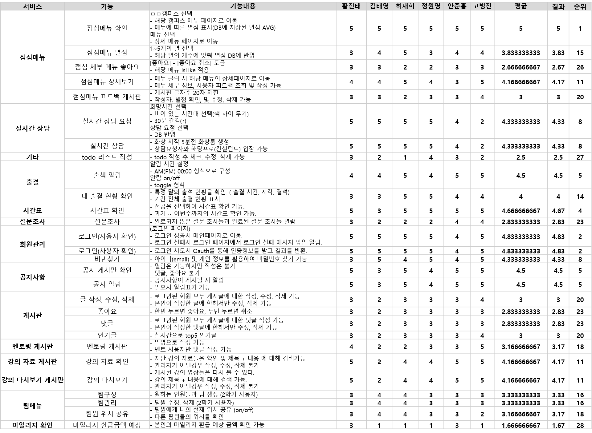

# 슬기로운 싸피생활(가제) 기능 명세

- 일단 단순히 구현했으면 하는 기능만 적어주시면 됩니다
- clone 받으시고 작성 후 push하면서 conflict이 발생할 수 있으니 참고바랍니다

### 기능 단순 정리

---

**여기서부터 기능 적어주시면 됩니다**

- 시간표
  - 커리큘럼 확인
- 프로젝트 팀원 or (교육생) 위치 공유
- 출결확인
  - 입실 및 퇴실 알람 기능
- 점심 메뉴 확인
  - 오늘의 메뉴 후기 남기기
- 프로님과 화상 삼당(Web RTC)
  - 담당 프로님과 교육생 모두 승인 시 진행
- 설문조사 등 todo 리스트 기능
- 마일리지 및 경험치 레이팅 기능(내 순위만 확인 가능)
- 팀구성
  - 팀관리
  - 팀원 현황
  - 프로젝트 관련 게시판(회의록, gantt chart, 명세서 등)
- 강의 다시보기
- 공지사항 확인
  - 새 공지사항에 대한 알림 기능
- 멘토링관련 게시판 이용

## FEEDBACK

- 기능의 우선순위 및 불필요한 기능 제거
- 점심 메뉴 좋아요만 표시하여 비평보다는 선호도 조사
- 특징 기능 필요 1~2개 정도
- 알림관련 기능을 강화
  ex) 설문조사 등록 여부 및 설문조사 종료 일정 시간 전 알림
  ex) 관리자가 설문조사가 안된 사람들에게 한 번에 알림 전송
- 교육생들의 참여를 위한 게이미피케이션 기능
  ex) 설문조사를 먼저 수행한 반
- 시간대별 필요 항목 표시

## 특징 기능

- 서류 작성
- 주어진 항목만 입력하면 필요한 서류 생성 및 제출

## 1/11 Refactoring

- 커리큘럼 공유 기능 (ex. 에브리타임의 시간표 공유)
  - 친구 맺기 가능 
  - 특정 기업, 직무를 필터로 친구목록 볼 수 있음
  - 위의 기능을 이용하여 관심분야에 맞는 스터디 모집 가능
  - RTC 기능 : 위치공유
